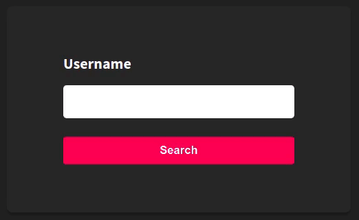
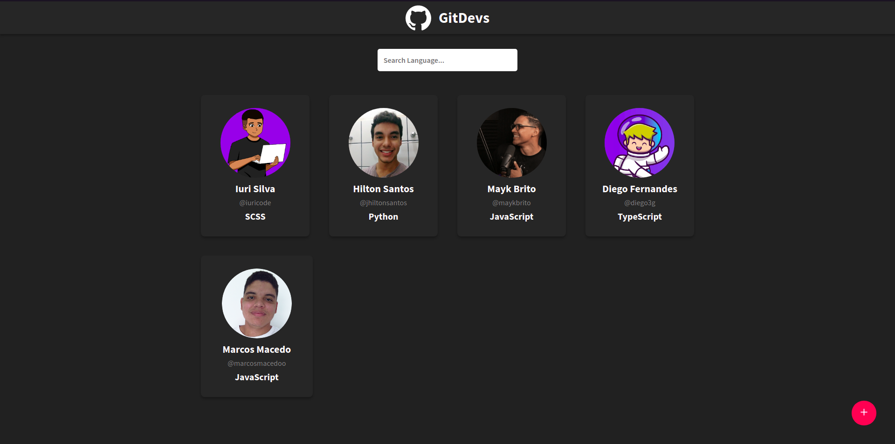
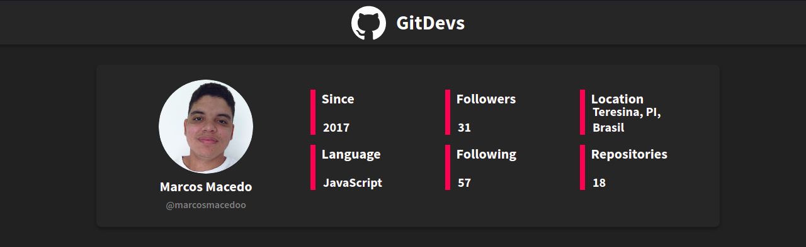

# GitDevs

## Funcionalidades

### Adicionando um Dev



### Listagem de Devs



### Dados do Dev



## Instalação

Faça o download do projeto:

```bash
git clone git@github.com:marcosmacedoo/gitdevs.git
```

Entre na pasta do projeto:

```bash
cd gitdevs/
```

Agora para instalar dependências utilize um gerenciador de pacotes: [Npm](https://www.npmjs.com/) ou [Yarn](https://classic.yarnpkg.com/en/) (preferência)

Se estiver utilizando `yarn`:
```bash
yarn
```

Caso esteja utilizando `npm`:
```bash
npm install
```

Com as dependências instaladas, execute o servidor do projeto:

> ATENÇÃO: É importante que a porta 3000 da sua máquina esteja livre

Se estiver utilizando `yarn`:
```bash
yarn start
```

Se estiver utilizando `npm`:
```bash
npm run start
```

